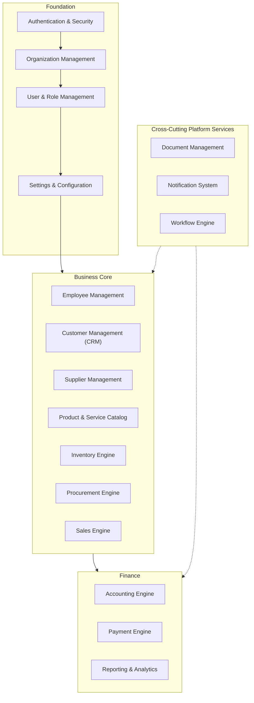
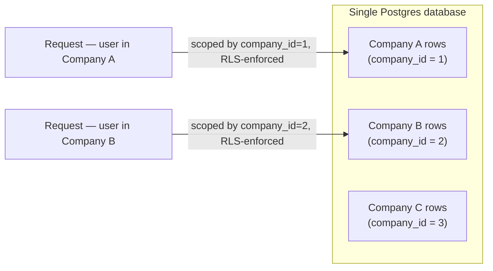
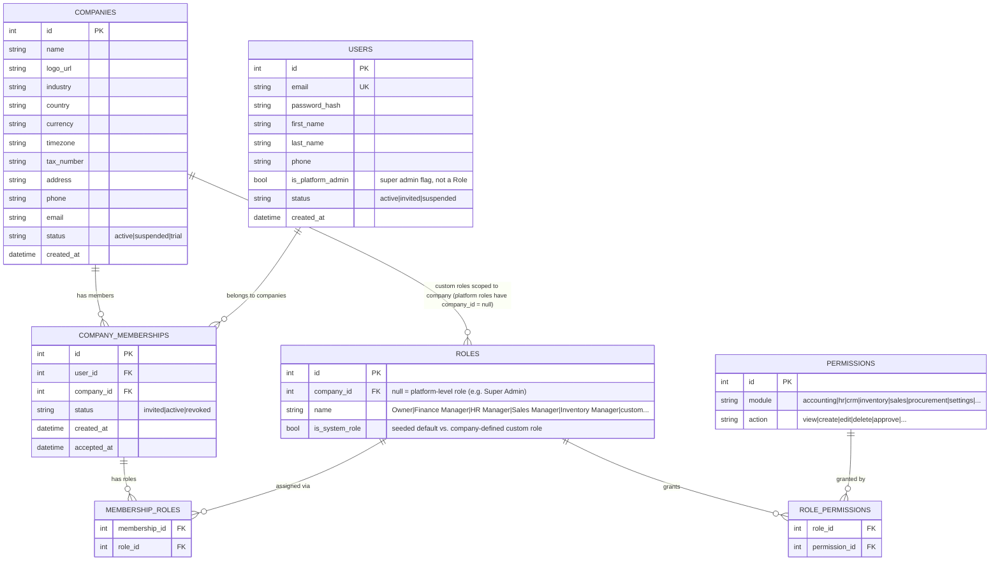
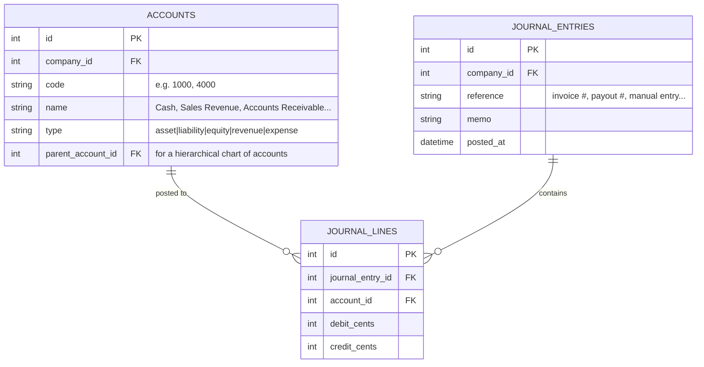

# CoreERP — Architecture & Product Overview

*A multi-tenant, modular ERP platform: one codebase, many companies, each with isolated data — auth, HR, CRM, inventory, sales, and accounting under a single roof, with industry-specific modules layered on later.*

---

## 1. Executive Summary

**The model**: CoreERP is a SaaS ERP platform. A single deployment serves many companies ("tenants"); each company's data — employees, customers, inventory, invoices, ledger — is fully isolated from every other company's, but they share the same application code, the same database, and the same set of modules. A company only sees the modules and data that belong to it.

**Core building blocks**: every module in the system (Employees, Customers, Items, Stock, Invoices, Journal Entries, ...) hangs off a `company_id`. There is no module-specific tenancy logic — isolation is enforced once, centrally, and every other module inherits it for free.

**Scope discipline**: ERP is an enormous domain. This architecture is deliberately phased — Foundation (auth, companies, users/roles/permissions) before Business Core (customers, suppliers, items, inventory, sales) before Finance (accounting, invoices, payments, reports) before Industry Modules (hotel, real estate, retail, healthcare, construction). Each phase must stand on its own and be usable before the next begins.

---

## 2. System Module Map



**Design principle**: Foundation modules are load-bearing for everything above them — no Business Core or Finance module is reachable without a company and an authenticated, permissioned user. Platform services (documents, notifications, workflow) are cross-cutting: any module can raise a notification or attach a document without owning that logic itself.

---

## 3. Multi-Tenant Architecture

**Chosen model: shared database, row-level isolation.** All companies live in one Postgres database and one schema. Every tenant-owned table carries a `company_id` foreign key, and every query is scoped by it. This is the pragmatic choice for an early-stage platform:

- One schema to migrate, one set of indexes to tune, one connection pool to operate.
- Adding a company is a row insert, not a provisioning step.
- Cross-tenant analytics (for the platform operator) are simple joins, not federated queries.

The tradeoff is that isolation is a *discipline*, not a structural guarantee — a missing `WHERE company_id = ...` is a data leak, not a query error. This is mitigated centrally, not per-endpoint:

- A request-scoped "current company" context is resolved once per request (from the authenticated user's active company) and threaded through a shared query layer/manager, so every model lookup is scoped automatically rather than relying on each view to remember.
- Postgres Row-Level Security (RLS) policies on tenant tables are the backstop: even a query that forgets to filter by `company_id` cannot read or write rows outside the session's current company.
- No raw, unscoped queries against tenant tables — enforced by code review and, where practical, a lint rule.



If a specific customer later needs stronger isolation (dedicated infrastructure, compliance requirements), that's a per-tenant exception to layer on top later — not a reason to complicate the default path now.

**Platform-level roles are the one exception**: the Super Admin role (platform operator) is *not* company-scoped — it manages the list of companies, billing, and cross-tenant platform settings, and its queries deliberately span all tenants.

---

## 4. Foundation Data Model (Phase 1)



**Why `COMPANY_MEMBERSHIPS` instead of a role directly on `USERS`**: a person can belong to more than one company (an accountant consulting for two clients, an owner of two businesses) with a different role in each. `USERS` holds identity only; `COMPANY_MEMBERSHIPS` is the join that says "this person is part of this company"; `MEMBERSHIP_ROLES` says what they can do there. Login resolves to a user, not a company — the user then picks (or is defaulted into, if they belong to only one) an **active company**, and that becomes the scoping context for the rest of the session.

**Permissions are `(module, action)` pairs**, not free-text strings, so authorization checks are structured (`user.has_permission(company, "accounting", "approve")`) rather than string-matched. Default roles (Owner, Finance Manager, HR Manager, Sales Manager, Inventory Manager) are seeded per company with a sensible starting `ROLE_PERMISSIONS` set; companies can clone and adjust them into custom roles.

---

## 5. Module Data Sketches (Phase 2 preview)

These are illustrative, not final schemas — real column lists get nailed down when each module is built. Every table below carries `company_id`.

```
Employees(id, company_id, first_name, last_name, email, phone, position,
          department_id, salary, joining_date, status)
Departments(id, company_id, name)

Customers(id, company_id, name, phone, email, type[individual|business|government|vip],
          address, created_at)

Suppliers(id, company_id, name, phone, email, address, tax_number)

Items(id, company_id, type[product|service], name, category, price, cost, tax_rate, status)

Warehouses(id, company_id, name, location)
Stock(id, company_id, item_id, warehouse_id, quantity, minimum_stock)
StockMovements(id, company_id, item_id, warehouse_id, type[in|out|transfer|adjustment],
               quantity, reference, created_at)

Quotations(id, company_id, customer_id, status, total_amount, created_at)
SalesOrders(id, company_id, customer_id, status, payment_status, total_amount, created_at)
Invoices(id, company_id, sales_order_id, invoice_number, amount, tax_amount, due_date, status)
```

**Deliberately generic `Items` catalog**: one table with a `type` of `product` or `service` covers a hotel's "Room Night", a retailer's "Laptop", and a real-estate company's "Service Fee" without a dedicated schema per industry. Industry Modules (Phase 4) extend this with vertical-specific tables (e.g. `RoomBookings` referencing an `Items` row) rather than replacing it.

---

## 6. Accounting Core (Phase 3 — the load-bearing module)

Correctness here matters more than breadth. Every financial fact in the system — an invoice paid, a payout sent, a bill received — ultimately becomes a balanced double-entry journal entry. Getting posting right and auditable comes before building reports on top of it.



**Hard rule**: a `JOURNAL_ENTRIES` row is only ever created with its `JOURNAL_LINES` in the same transaction, and `sum(debit_cents) == sum(credit_cents)` across those lines is enforced at the point of posting, not checked after the fact. Example — a customer pays $100 against an invoice:

```
Debit:  Cash                  +100
Credit: Accounts Receivable   -100
```

**Phase 3 scope, deliberately bounded**:
- ✅ Chart of Accounts (seeded default set per company, extensible)
- ✅ Journal Entries / General Ledger (the postings engine described above)
- ✅ Accounts Payable / Accounts Receivable (thin ledgers over the same journal-line mechanism)
- ✅ Financial Reports (P&L, Balance Sheet) — read-side aggregations over the ledger, built once postings were trustworthy; see TODO.md for the verification that a real Balance Sheet actually balances.

---

## 7. Cross-Cutting Platform Services

| Service | Responsibility | Consumed by |
|---|---|---|
| **Document Management** | Store and retrieve files (invoices as PDF, ID scans, contracts) against any record in any module | Every module |
| **Notification System** | In-app (and later email) notifications, gated by per-user preference toggles, always company-scoped | Sales (new order), Inventory (low stock), Finance (invoice overdue), HR (leave approved) |
| **Workflow Engine** | Configurable approval chains (e.g. purchase order over a threshold needs manager sign-off) | Procurement, Sales, HR |
| **Reporting & Analytics** | Company-scoped dashboards: revenue, expenses, profit, sales, inventory, pending payments | Every module feeds it; nothing else depends on it |

These are built once as shared services with a stable interface (e.g. `notify(company_id, user_id, type, payload)`, `attach_document(company_id, owner_type, owner_id, file)`) so that adding a new business module never means reinventing notifications or file storage.

---

## 8. Roles, Dashboards & Permission Matrix

### Platform-level
**Super Admin** (`is_platform_admin = true`, not a company `Role`) — manage the list of companies, billing, platform-wide settings. Not scoped by `company_id`.

### Company-level default roles

| Action | Owner | Finance Mgr | HR Mgr | Sales Mgr | Inventory Mgr |
|---|:---:|:---:|:---:|:---:|:---:|
| View company dashboard | ✓ | ✓ | ✓ | ✓ | ✓ |
| Manage users/roles/settings | ✓ | ✗ | ✗ | ✗ | ✗ |
| Accounting, payments, financial reports | ✓ | ✓ | ✗ | ✗ | ✗ |
| Employees, payroll | ✓ | ✗ | ✓ | ✗ | ✗ |
| Customers, sales, quotations | ✓ | ✗ | ✗ | ✓ | ✗ |
| Stock, warehouses | ✓ | ✗ | ✗ | ✗ | ✓ |

Enforced server-side via `permission_required(company, module, action)` checked on every request that touches company data — the same pattern ClipBirr uses for brand team permissions (`requireBrandPermission`), never inferred from role labels in the UI alone. These five are seed defaults; a company can clone one into a custom `Role` and adjust its `ROLE_PERMISSIONS`.

---

## 9. Tech Stack

| Layer | Choice | Notes |
|---|---|---|
| Backend | Django + Django REST Framework | Batteries-included (admin, ORM, migrations, auth primitives) — a good fit for CRUD-heavy, permission-heavy ERP domains |
| Database | PostgreSQL | Row-Level Security used as the tenancy backstop (Section 3) |
| Frontend | Next.js + TypeScript | Consistent with the team's other project (ClipBirr); good dashboard/SSR ergonomics |
| Auth | Session- or token-based via DRF, company-context resolved per request | See Section 4 for the membership/role model |
| Background jobs | Deferred until there's an actual async workload (e.g. report generation, imports) | Don't stand up Celery/Redis before there's a job to run |
| Mobile | Deferred | Flutter app is a Phase 4+ conversation once the API is stable |
| File storage | Local disk in development; object storage (S3-compatible) once deployed | Behind the Document Management interface (Section 7), so the switch doesn't touch calling code |
| Local dev | Docker Compose (Postgres + Django + Next.js) | No VPS/Nginx/Gunicorn provisioning needed until there's something worth deploying |

**Deliberately deferred**: production infrastructure (Ubuntu VPS, Nginx, Gunicorn, Redis, Celery, S3) and the Flutter mobile client. These are real Phase 2+ decisions, not Phase 1 blockers — building them now would be solving deployment and mobile-distribution problems before there's a working core to deploy or a screen worth putting on a phone.

---

## 10. Development Roadmap

**Phase 1 — Foundation**
Authentication, multi-company (`COMPANIES`, `COMPANY_MEMBERSHIPS`), Users, Roles & Permissions (seeded defaults), Settings. A user can sign up, create or join a company, and see an empty but permission-gated dashboard. Nothing else is buildable without this.

**Phase 2 — Business Core**
Employees & Departments, Customers (CRM), Suppliers, Product & Service Catalog (`Items`), Inventory Engine (Warehouses/Stock/Stock Movements), Procurement Engine, Sales Engine (Quotations → Sales Orders → Invoices).

**Phase 3 — Finance**
Accounting Engine (Chart of Accounts, Journal Entries, General Ledger, AP/AR), Payment Engine, Financial Reports, company-wide Dashboard (revenue/expenses/profit/sales/customers/inventory/employees/pending payments).

**Phase 4 — Industry Modules**
Vertical extensions on top of the generic core: Hotel (room bookings, folios), Real Estate (leases, units), Retail (POS), Healthcare (patient records), Construction (project costing). Each extends `Items`/`Sales`/`Inventory` rather than duplicating them — evaluated and prioritized based on which vertical has real demand once Phases 1–3 are live.

---

## 11. Open Decisions / Risks

- **Row-Level Security enforcement**: RLS policies are the tenancy backstop, not the primary mechanism — they need to be written and tested per tenant-owned table as each module ships, not bolted on retroactively once there's real data to leak.
- **Multi-company membership UX**: a user with memberships in several companies needs a clear "active company" switcher and session/context handling; this touches auth from day one even though it looks like a Phase 2+ nicety.
- **Custom roles vs. seeded defaults**: the five default roles (Section 8) cover common cases, but ERPs live and die on flexible permissioning — worth revisiting after a few real companies are on the platform and requesting roles that don't fit the default five.
- **Django admin as an internal tool**: DRF ships a powerful admin site for free: worth deciding early whether platform-operator tooling (Super Admin's company/billing management) is a thin custom UI or largely Django admin, since that's a significant scope difference.
- **Industry Module prioritization**: Phase 4's five verticals are illustrative, not committed — which one (if any) gets built first should be driven by actual demand, not built speculatively.
